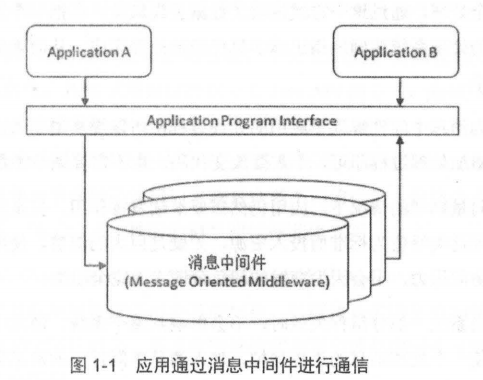

#  RabbitMQ 简介

RabbitMQ 是目前非常热门的一款 **消息中间件**，不管是互联网行业还是传统行业都在大量使用。它具有高可靠、易扩展、高可用及丰富的功能特性。

## 什么是消息中间件

**消息（Message）**：在应用层传送的数据。比如文本字符串、JSON 等。

**消息队列中间件（Message Queue Middleware，MQ）**：利用 **可靠的消息传递机制** 进行 **与平台无关的数据交流**，并基于数据通信来进行分布式系统的集成。通过消息排队模型，它可以在 **分布式环境下扩展进程间的通信**。

消息队列中间件一般有两种传递模式：

- 点对点（P2P，Point-to-Point）模式

  基于 **队列**，消息生产者发送消息到队列，消息消费者从队列中接收消息。

  队列的存在使得消息的 **异步传输**成 为可能。

- 发布/订阅（Pub/Sub）模式

  定义了如何向一个内容节点发布和订阅消息，内容节点称为 **主题（topic）**，消息发布者将消息 **发布到某个主题**，而消息订阅者则 **从主题中订阅消息**。

  该模式在 **消息的一对多广播时采用**

消息中间件适用于需要可靠的数据传送的分布式环境。发送者将消息发送给消息服务器，消息服务器将 **消息存放在若干队列中**，在合适的时候再将消息 **转发给接收者**。实现应用程序之间的协同，优点在于能够在客户和服务器之间提供同步和异步的链接，并且在任何时刻都可以将消息进行传送或存储转发。



例如上图：A、B程序使用消息中间件进行通信。程序 A、B 可以不在同一台服务器上，A 发送消息给 B，消息中间件负责处理网络通信，如果网络连接不可用，会存储消息，直到连接变得可用，再将消息转发给 B。

灵活的体现在于：程序 B 可以不在线，A 也能投递消息，防止 A 等待 B 处理出现的阻塞。

## 消息中间件的作用

在不同的应用场景下有不同的作用，总的来说，可以概括如下：

- 解耦

  对于项目的变化，很难预测到未来的变动。消息中间件在处理过程中间插入了一个隐含、基于数据的接口层，两边的处理过程都要实现这一接口，但是两边都可以独立的扩展或则修改自己的处理过程，只要 **确保他们遵守同样的接口约束** 即可。

- 冗余（存储）

  某些情况下，处理数据的过程可能失败。消息中间件可以把数据持久化直到他们已经被完全处理，通过这一方式 **规避了数据丢失的风险**。

  在把一个消息从中间件删除时，需要你明确的指出该消息已经被处理完成。

- 扩展性

  因为 **解耦了应用程序的处理过程**，所以 **提高消息入队** 和 **处理效率** 就变得很容易了，只要增加额外的处理过程即可，不需要改变代码和参数

- 削峰

  在访问量剧增的场景下，应用需要继续发挥作用，但是这样的突然流量并不常见。如果以能处理这类峰值为标准而投入资源（比如硬件），无疑是巨大的浪费。使用消息中间件能够使关键组件支持突发访问压力，不会因为突发的超负荷请求而完全崩溃。

- 可恢复性

  当系统一部分组件失效时，不会影响到整个系统。当这部分组件被修复后，再连接上消息中间件，可以继续处理未处理完的消息。

- 顺序保证

  大多数场景下，数据处理的顺序很重要，大部分消息中间件支持一定程度上的顺序性。

- 异步通信

  在很多时候，应用不想也不需要立即处理消息。将消息放入消息中间件中，但并不立即处理它，在之后需要的时候再慢慢处理。

## RabbitMQ 的起源

RabbitMQ 是采用 Erlang 语言实现 **AMQP（Advanced Message Queuing Protocol）高级消息队列协议** 的消息中间件，最初起源于金融系统，用于在 **分布式系统中存储转发消息**。

商业 MQ 供应商想要解决 **应用互通** 的问题，而不是去创建标准来实现不同的 MQ 产品间的互通，或则运行应用程序更改 MQ 平台。价格高昂、还不通用。

为了解决这种困境，**JMS（Java Message Service）** 就应运而生。JMS 试图通过提供 **公共 Java API**  的方式，隐藏单独 MQ 产品供应商提供的时实际接口，解决了互通问题。从技术上讲：只要针对 JMS API 编程，选择合适的 MQ 驱动，JMS 会打理好其他的部分。**ActiveMQ** 就是 JMS 的一种实现。由于 JMS 使用单独标准化接口来胶合众多不同的接口，最终会暴露出问题，使得程序变得脆弱。急需一种新的消息通信标准化方案。

2006 年 6 月，由 Cisco、Redhat、iMatix 等联合制定了 AMQP 的公开标准，它是 **应用层协议的一个开放标准**，以解决众多消息中间件的需求和拓扑结构问题。它为 **面向消息的中间件** 设计，基于此协议的客户端与消息中间件可传递消息，并 **不受产品、开放语言等条件的限制**。

RabbitMQ 最初版本实现了 AMQP 的一个关键特性：使用协议本身就可以对队列和交换器（Exchange）这样的资源进行配置。而商业 MQ 则需要特定的管理终端。RabbitMQ 的资源配置能力使其成为构建分布式应用的最完美的通信总线。

Rabbit 英译为兔子，含义为：兔子行动非常迅速且繁殖起来非常疯狂。因此使用 RabbitMQ 来命名这个分布式软件。

RabbitMQ 发展到今天，被越来越多人认可，这和它在易用性、扩展性、可靠性和高可用性等方面的卓越表现是分不开的。具体特点可以概括为以下几点：

- 可靠性：使用一些机制来保证可靠性

  如：持久化、**传输确认**、**发布确认**等。

- 灵活的路由：在消息进入队列之前，通过 **交换器** 来 **路由** 消息

  对于典型的路由功能，提供了 **内置的交换器** 来实现。针对复杂的路由功能，可以 **将多个交换器绑定在一起**，也可以通过 **插件机制** 来实现自己的交换器

- 扩展性：多个 RabbitMQ 节点可以组成一个集群，也可以动态扩展集群节点。

- 高可用性：

  **队列** 可以在集群中的机器上设置 **镜像**，使得在部分节点出现问题的情况下，队列仍然可用。

- 多种协议：原生支持 AMQP 协议

  还支持 STOMP、MQTT 等多种消息中间件协议
  
- 多语言客户端：支持常用语言客户端

  如：Java、Python、Ruby、PHP、`C#`、JavaScript

- 管理界面

  提供了一个易用的用户界面，使得用户可以 **监控和管理消息、集群中的节点** 等

- 插件机制：

  提供了许多插件，以实现从多方面进行扩展，也可以自己编写插件。

## RabbitMQ 的安装及简单使用

先介绍 RabbitMQ 的安装过程，然后演示发送和消费消息的具体实现。

本书如无特指，所有程序都在 Linux 下运行。

### 安装 Erlang

前面说到过，RabbitMQ 是由 Erlang 语言编写的， 需要先下载；本书采用 [19.x 版本](https://www.erlang.org/downloads/19.3)。[下载链接](http://erlang.org/download/otp_src_19.3.tar.gz)

```bash
# 安装依赖模块
[root@study opt]# yum -y install make gcc gcc-c++ kernel-devel m4 ncurses-devel openssl-devel
[root@study opt]# yum install ncurses-devel
# 解压缩与配置
[root@study opt]# cd /opt
[root@study opt]# tar zxvf otp_src_19.3.tar.gz
[root@study opt]# cd otp_src_19.3
[root@study otp_src_19.3]# ./configure --prefix=/opt/erlang --with-ssl --enable-threads --enable-smp-support --enable-kernel-poll --enable-hipe --without-javac

# 安装 erlang
[root@study otp_src_19.3]# marke && make install

# 配置环境变量
[root@study ~]# vim /etc/profile
ERLANG_HOME=/opt/erlang
export PATH=$PATH:$ERLANG_HOME/bin
export ERLANG_HOME
[root@study ~]# source /etc/profile

# 验证是否安装成功
[root@study otp_src_19.3]# erl
Erlang/OTP 19 [erts-8.3] [source] [64-bit] [async-threads:10] [hipe] [kernel-poll:false]
```


### 安装 RabbitMQ

使用 [3.6.15 版本](https://github.com/rabbitmq/rabbitmq-server/releases/tag/rabbitmq_v3_6_15)，[下载链接](https://github.com/rabbitmq/rabbitmq-server/releases/download/rabbitmq_v3_6_15/rabbitmq-server-generic-unix-3.6.15.tar.xz)

```bash
[root@study opt]# cd /opt
[root@study opt]# tar -xvJf rabbitmq-server-generic-unix-3.6.15.tar.xz
[root@study opt]# mv rabbitmq_server-3.6.15/ rabbitmq

# 配置环境变量
[root@study opt]# vim /etc/profile
export PATH=$PATH:/root/server/rabbitmq/sbin
export RABBITMQ_HOME=/root/server/rabbitmq
[root@study ~]# source /etc/profile
```

运行 RabbitMQ

```bash
# 使用 -detached 参数是为了让 RabbitMQ 以守护进程方式在后台运行
[root@study ~]# rabbitmq-server -detached
Warning: PID file not written; -detached was passed.

# 查看 RabbitMQ 状态
[root@study ~]# rabbitmqctl status
Status of node rabbit@study
[{pid,25358},
 {running_applications,
     [{rabbit,"RabbitMQ","3.6.15"},
      {mnesia,"MNESIA  CXC 138 12","4.14.3"},
      {os_mon,"CPO  CXC 138 46","2.4.2"},
      {rabbit_common,
          "Modules shared by rabbitmq-server and rabbitmq-erlang-client",
          "3.6.15"},
      {syntax_tools,"Syntax tools","2.1.1"},
      {ranch,"Socket acceptor pool for TCP protocols.","1.3.2"},
      {ssl,"Erlang/OTP SSL application","8.1.1"},
      {public_key,"Public key infrastructure","1.4"},
      {crypto,"CRYPTO","3.7.3"},
      {asn1,"The Erlang ASN1 compiler version 4.0.4","4.0.4"},
      {compiler,"ERTS  CXC 138 10","7.0.4"},
      {xmerl,"XML parser","1.3.13"},
      {recon,"Diagnostic tools for production use","2.3.2"},
      {sasl,"SASL  CXC 138 11","3.0.3"},
      {stdlib,"ERTS  CXC 138 10","3.3"},
      {kernel,"ERTS  CXC 138 10","5.2"}]},
 {os,{unix,linux}},
...
# 可以看到启动成功了

# 还可以查看集群信息，现在只有一个节点
[root@study ~]# rabbitmqctl cluster_status
Cluster status of node rabbit@study
[{nodes,[{disc,[rabbit@study]}]},
 {running_nodes,[rabbit@study]},
 {cluster_name,<<"rabbit@study">>},
 {partitions,[]},
 {alarms,[{rabbit@study,[]}]}]

```

### 新增账户

默认情况下 RabbitMQ 有一个 guest 账户，只允许通过  `localhost` 访问，远程网络访问受限。所以需要新添加一个账户

```bash
# 创建 admin 用户，密码为 root
[root@study ~]# rabbitmqctl add_user admin root
Creating user "admin"

# 设置用户拥有所有权限
[root@study ~]# rabbitmqctl set_permissions -p / admin ".*" ".*" ".*"
Setting permissions for user "admin" in vhost "/"

# 设置 admin 用户为 管理员角色
[root@study ~]# rabbitmqctl set_user_tags admin administrator
Setting tags for user "admin" to [administrator]
```


### 生产和消费

本章演示如何使用 RabbitMQ Java 客户端生产和消费消息。

添加依赖包，笔者使用 gradle 管理项目依赖

```groovy
compile 'com.rabbitmq:amqp-client:4.2.1'
```

#### 生产者

```java
/**
 * 生产者； 一个完整的建立连接、创建信道、创建交换器、创建队列、通过路由键绑定、发送消息、关闭资源
 */
public class RabbitProducer {
    private static final String EXCHANGE_NAME = "exchange_demo";
    private static final String ROUTING_KEY = "routingky_demo";
    private static final String QUEUE_NAME = "queue_demo";
    private static final String IP_ADDRESS = "192.168.4.250";
    // rabbitMq 服务端默认端口为 5672
    private static final int PORT = 5672;

    public static void main(String[] args) throws IOException, TimeoutException {
        final ConnectionFactory factory = new ConnectionFactory();
        factory.setHost(IP_ADDRESS);
        factory.setPort(PORT);
        factory.setUsername("admin");
        factory.setPassword("root");
        final Connection connection = factory.newConnection();
        final Channel channel = connection.createChannel();
        // 创建一个 type=direct 持久化、非自动删除的交换器
        channel.exchangeDeclare(EXCHANGE_NAME, "direct", true, false, null);
        // 创建一个：持久化、非排他的、非自动删除的队列
        channel.queueDeclare(QUEUE_NAME, true, false, false, null);
        // 将交换器与队列通过 路由键 绑定
        channel.queueBind(QUEUE_NAME, EXCHANGE_NAME, ROUTING_KEY);

        String message = "Hello World!";
        channel.basicPublish(EXCHANGE_NAME,
                ROUTING_KEY,
                MessageProperties.PERSISTENT_TEXT_PLAIN,
                message.getBytes());

        // 关闭资源
        channel.close();
        connection.close();
    }
}
```

这里一个完整模板代码流程：

1. 建立连接
2. 创建信道
3. 创建交换器
4. 创建队列
5. 通过路由键绑定
6. 发送消息
7. 关闭资源

#### 消费者

```java
package cn.mrcode.rabbitmq;

import com.rabbitmq.client.AMQP;
import com.rabbitmq.client.Address;
import com.rabbitmq.client.Channel;
import com.rabbitmq.client.Connection;
import com.rabbitmq.client.ConnectionFactory;
import com.rabbitmq.client.DefaultConsumer;
import com.rabbitmq.client.Envelope;

import java.io.IOException;
import java.util.concurrent.TimeUnit;
import java.util.concurrent.TimeoutException;

/**
 * 消费者
 */
public class RabbitConsumer {
    private static final String QUEUE_NAME = "queue_demo";
    private static final String IP_ADDRESS = "192.168.4.250";
    private static final int PORT = 5672;

    public static void main(String[] args) throws IOException, TimeoutException, InterruptedException {
        final Address[] addresses = {
                new Address(IP_ADDRESS, PORT)
        };
        final ConnectionFactory factory = new ConnectionFactory();
        factory.setUsername("admin");
        factory.setPassword("root");

        // 这里的联机方式与生产者的 demo 略有不同
        final Connection connection = factory.newConnection(addresses);
        final Channel channel = connection.createChannel();
        // 设置客户端最多接收未被 ack 的消息个数
        channel.basicQos(64);
        channel.basicConsume(QUEUE_NAME, new DefaultConsumer(channel) {
            @Override
            public void handleDelivery(String consumerTag,
                                       Envelope envelope,
                                       AMQP.BasicProperties properties,
                                       byte[] body) throws IOException {
                System.out.println("recv message: " + new String(body));
                try {
                    TimeUnit.SECONDS.sleep(1);
                } catch (InterruptedException e) {
                    e.printStackTrace();
                }
                channel.basicAck(envelope.getDeliveryTag(), false);
            }
        });

        // 等待消费者回调后，关闭资源
        TimeUnit.SECONDS.sleep(10);
        channel.close();
        connection.close();
    }
}
```

运行生产者和消费者后，消费者会打印出 `recv message: Hello World!`

