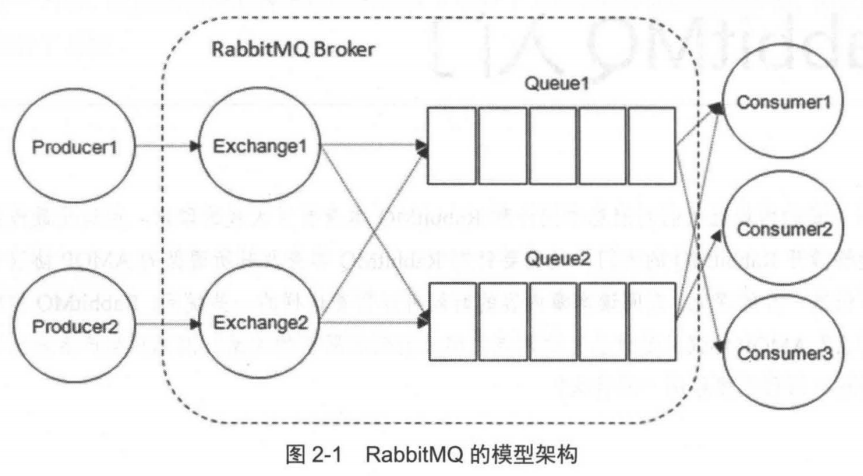
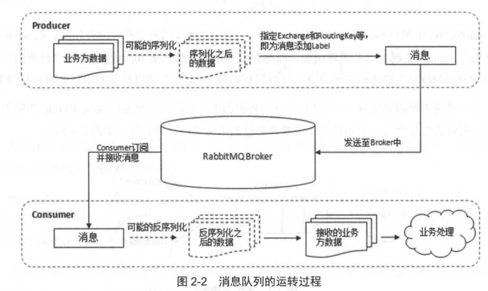
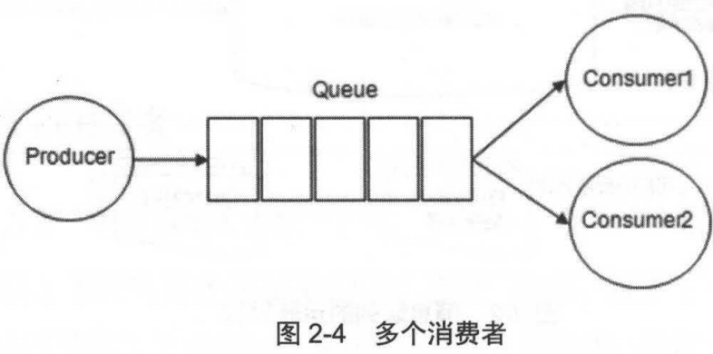
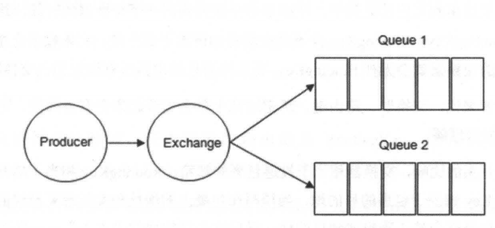
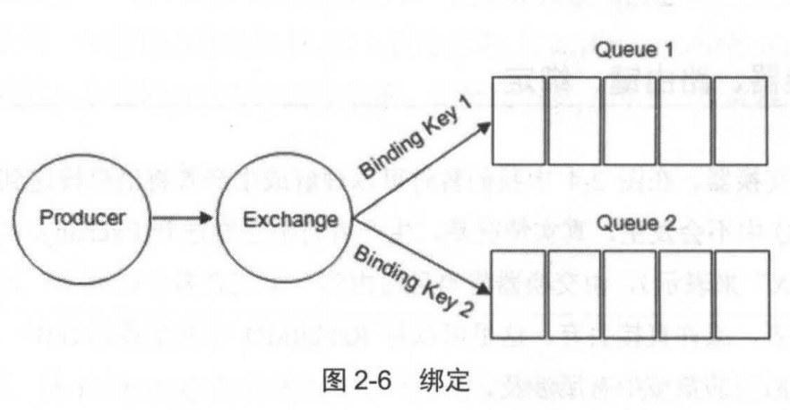
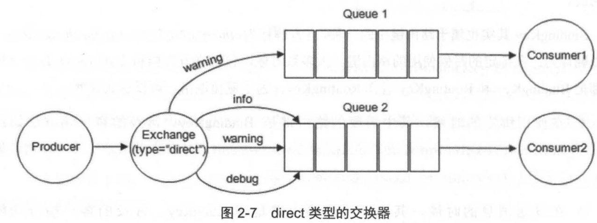
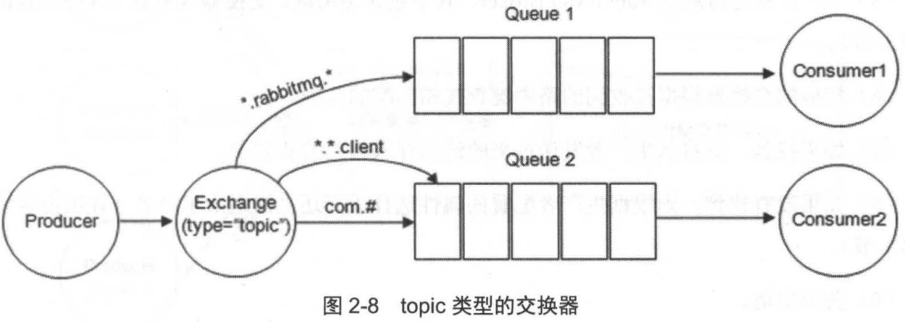
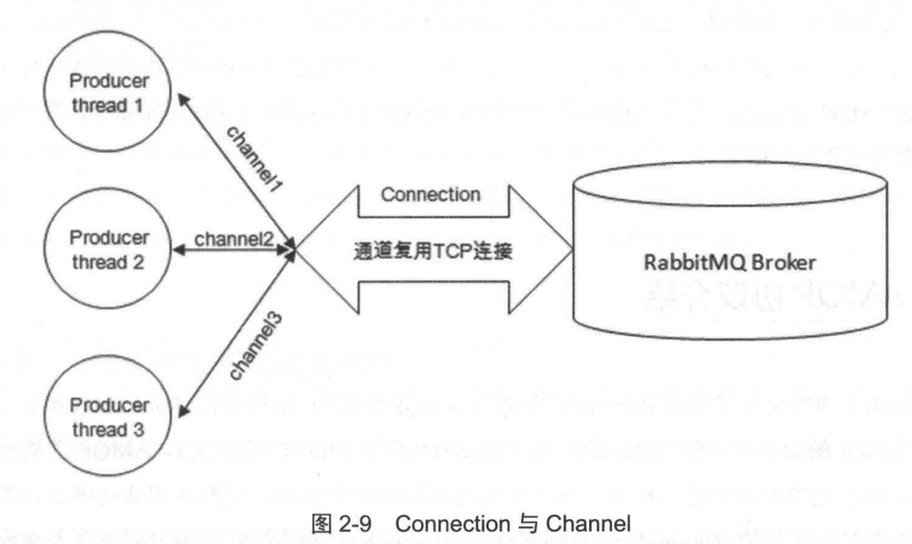

# 相关概念介绍

RabbitMQ 整体上是一个 **生产者与消费者模型**，主要负责 **接收、存储和转发消息**。



## 生产者和消费者

### 生产者

Producer：生产者，投递消息的一方

生产者创建消息，发布到 RabbitMQ 中。

消息一般可以包含 2 个部分：

- 消息体（payload）

  你的业务数据，比如一个 JSON 字符串

- 标签（label）：用来描述这条消息

  比如：一个交换器的名称和一个路由键。RabbitMQ 会根据标签把消息发送给感兴趣的消费者（Consumer）

### 消费者

Consumer：消费者，接收消息的一方

消费者链接到 RabbitMQ，并 **订阅到队列** 上。当消费者消费一条消息时，只是消费消息的 **消息体（payload）**，路由过程中，**消息的标签会丢弃**，**存入到队列中的消息只有消息体**。

消费者不知道生产者是谁。

### Broker

Broker：消息中间件的服务节点。

对于 RabbitMQ 来说，一个 Broker 可以简单看成一个 RabbitMQ 服务节点，或则 RabbitMQ 服务实例。

下图展示了：生产者将消息存入 Broker，以及消费者从 Broker 中消费数据的整个流程



- 生产者将消息发送到 Broker 中

  发送：对应的 AMQP 协议命令为  `Basic.Publish`

- 消费者订阅并接收消息

  订阅并接收：对应的 AMQP 协议命令为 `Basic.Consume` 或 `Basic.Get`

## 队列

Queue：队列 ，是 RabbitMQ 的内部对象，用于存储消息。

RabbitMQ 中消息都 **只能存储在队列中**，kafka 将消息存储在 topic 这个逻辑层面中，而相对应的队列逻辑知识 topic 实际存储文件中的位置偏移标识。

**多个消费者可以订阅同一个队列**，这时队列中的消息会被 **平均分摊**（Round-Robin 轮询）给多个消费者进行处理。



RabbitMQ **不支持队列层面的广播消息**，如果需要广播消费，需要进行二次开发，麻烦，不推荐。

## 交换器、路由键、绑定

### Exchange 交换器

在图 2-4 中，消息并不是直接到队列中的，而是消息先到 Exchange（交换器，通常用大写的 X 表示），**由交换器将消息路由到一个或多个队列中**。如果路由不到，或许会返回给生产者，或许会直接丢弃。

示意图如下



RabbitMQ 中的交换器有 4 种类型，不同的类型有不同的策略，后续详细讲解。

### RoutingKey 路由键

生产者将消息发给交换器时，一般会指定一个 RoutingKey，用来指定这个消息的路由规则。

RoutingKey 需要与**交换器类型**和 **绑定键（BindingKey）** 联合使用才能最终生效

### Binding 绑定

通过 **绑定** 将 **交换器与队列关联** 起来，绑定时一般会指定一个 **绑定键（BindingKey）**，这样 RabbitMQ 就知道如何正确将消息路由到队列了，示意图如下：



生产者将消息发送给交换器时，需要一个 RoutingKey，**当 BindingKey 和 RoutingKey 匹配时**，消息被路由到对应的队列中。

绑定多个队列到同一个交换器时，BindingKey 允许相同。BindingKey 只能在 **指定的交换器类型下生效**，比如 fanout 类型的交换器就不生效，它将消息路由到所有绑定到该交换器的队列中。

其实你已经发现了：在某些情况下，RoutingKey 与 BindingKey 可以看成是同一个东西，因为他们要匹配才能路由。

```java
// 创建一个 type=direct 持久化、非自动删除的交换器
channel.exchangeDeclare(EXCHANGE_NAME, "direct", true, false, null);
// 创建一个：持久化、非排他的、非自动删除的队列
channel.queueDeclare(QUEUE_NAME, true, false, false, null);
// 将交换器与队列通过 路由键 绑定
channel.queueBind(QUEUE_NAME, EXCHANGE_NAME, ROUTING_KEY);

String message = "Hello World!";
channel.basicPublish(EXCHANGE_NAME,
                     ROUTING_KEY,
                     MessageProperties.PERSISTENT_TEXT_PLAIN,
                     message.getBytes());
```

如上部分代码，声明了一个 direct 类型的交换交换器，将队列绑定到交换机使用的是 ROUTING_KEY，这里本应该使用 BindingKey， `channel.basicPublis` 中发送消息也使用了 ROUTING_KEY，这说明在 direct 类型的交换器中他们是同一个东西。

但是在 topic 交换器类型下，ROUTING_KEY 和 BindingKey 之间需要做模糊匹配，他们就不是相同的了；

为了避免混淆，可以如下理解：

- 在使用绑定的时候，需要的是 BindingKey 

  对应的 API 是 `channel.exchangeBind` 、`channel.queueBind` 

  对应的 AMQP 命令是 `Exchange.Bind` 、`Queue.Bind`

- 在发送消息时，使用的是 ROUTING_KEY 

  对应的 API 是：`channel.basicPublish`

  对应的 AMQP 命令是：`Basic.Publish`

## 交换器类型

RabbitMQ 常用的交换器类型有：

- fanout：相当于广播消息，广播到绑定到交换器的队列
- direct：路由到 RoutingKey 与 BindingKey 相同的队列
- topic
- headers

AMQP 协议里还有两种类型：System 和 自定义。这里只讲解以上 4 种类型。

### fanout

把所有发送到该交换器的消息路由到所有与交换器绑定的队列中。**相当于广播消息**

### direct

把消息 **路由到 BindingKey 和 RoutingKey 完全匹配的队列中**。



Queue 2  绑定了 3 个 BindingKey，当消息指定的 RoutingKey 为 warming 时，两个队列都能收到，为 info 时，就只有 Queue 2 能收到。

### topic

与 direct 类型的交换器相似，也是将消息路由到 RoutingKey 与 BindingKey 相匹配的队列中，但是这里的匹配规则不同，它约定：

- RoutingKey 为一个点号「`.`」分隔的字符串

  被「`.`」 分隔开的每一段独立的字符串成为一个单词。如 `com.rabbitmq.client`

- BindingKey 和 RoutingKey 一样也是一个点号「`.`」分隔的字符串

- BindingKey 中可以存在两种特殊字符串，用作模糊匹配

  - `#`：用于匹配一个单词

  - `*`：用于匹配多规格的单词，可以是零个

    



对于以上设置绑定关系，如下的路由键路由方向为：

- `com.rabbitmq.client`：同时路由到 Q1 和 Q2
- `com.hidden.client`：只路由到 Q2
- `com.hidden.demo`：只路由到 Q2，因为匹配了 ``com.hidden`
- `java.rabbitmq.demo`：只会路由到 Q1
- `java.util.concurrent`：没有匹配任何路由键，可能被丢弃或返回给生产者（需要设置 mandatory 参数）

### headers

headers 类型的交换器 **不依赖于路由键的匹配规则来路由消息**，根据发送的消息内容中的 **headers 属性进行匹配**。

在绑定队列和交换器时制定一组键值对，发送消息到交换器时，会获取该消息的 headers ，对比其中的键值对是否完全匹配队列和交换器绑定时指定的键值对，完全匹配则路由到该队列。

headers 类型的交换器性能会很差，不推荐使用。

## RabbitMQ 的运转流程

回顾下整个消息队列的使用过程，在最初状态下，生产者发送消息时：

1. 连接到 RabbitMQ Broker，建立一个连接 Connection，开启一个信道 Channel

2. 声明一个交换器，并设置相关属性

   比如：交换器类型、是否持久化等

3. 声明一个队列，并设置相关属性

   比如：是否排他、是否持久化、是否自动删除等

4. 通过路由键将交换器和队列绑定起来

5. 发送消息到 Broker

   其中包含：路由键、交换器等信息

6. 相应交换器根据接收到的路由键查找匹配的队列

7. 如果找到：则存入相应的队列中。

8. 如果没有找到：则根据生产者配置的属性，选择丢弃还是回退给生产者

9. 关闭信道和链接

消费者接收消息的过程：

1. 链接到 RabbitMQ Broker，建立一个链接 Connection，开启一个信道 Channel
2. 向 Broker 请求消费相应队列中的消息，可能会设置相应的回调函数，以及做一些准备工作
3. 等待 Broker 回应并投递相依队列中的消息，消费者接收消息
4. 消费者确认（ack）接收消息
5. RabbitMQ 从队列中删除相应以及被确认的消息
6. 关闭信道和链接



无论生产者与消费者都要与 Broker 建立连接，该链接就是一条 TCP 链接（Connection）。客户端可以创建一个 AMQP 信道（Channel），**每个信道会被指派一个唯一的 ID**。

**信道是建立在 Connection 之上的虚拟连接**，RabbitMQ 处理的每条 AMQP 指令都是通过信道完成的。这个模式是类似 NIO（Non-blocking I/O）的做法，TCP 链接复用，减少性能开销，同时也便于管理。

::: tip NIO

NIO 也称非阻塞 I/O，包含三大核心部分：Channel 信道、Buffer 缓冲区、Selector 选择器。

NIO 基于 Channel 和 Buffer 进行操作，数据总是从信道读取到缓冲区中，或则从缓冲区写入到信道中。

Selector 用于监听多个信道的事件（如：打开链接、数据到达等）。因此，单线程可以监听多个数据的信道。

NIO 中有一个很有名的 [Reactor 模式](https://zq99299.github.io/note-book/mycat/frontend_connection_interaction.html#%E5%9F%BA%E7%A1%80%E7%9F%A5%E8%AF%86)。

:::

所以你的程序具体需要几个 Connection ，这个需要根据你业务量来进行调节，当一个 Connection 上的信道太多时，可能会产生瓶颈，就需要考虑使用多个 Connection 了。

信道在 AMQP 中是一个很重要的概念，大多数操作都在信道这个层面展开的。在前面的代码演示中，也可以看到，很多操作都是在 Channel 对象上完成的。
