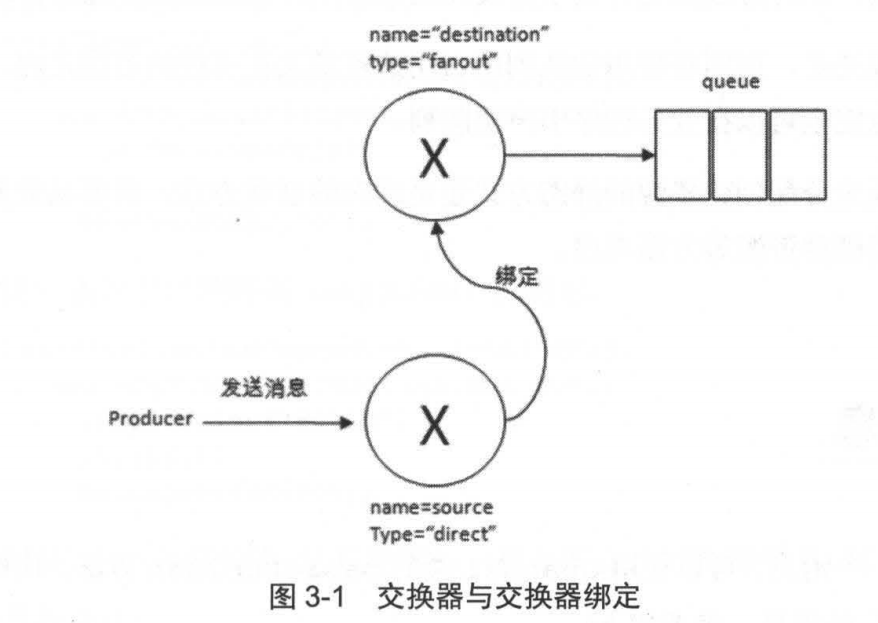

# 使用交换器和队列

交换器和队列再 AMQP 中高层面的构建模块，应用程序需确保在使用他们的时候，就已经存在了，在使用之前需要先声明（declare）他们

创建临时队列：

```java
channel.exchangeDeclare(EXCHANGE_NAME, "direct", true);
final String queue = channel.queueDeclare().getQueue();
channel.queueBind(queue, EXCHANGE_NAME, routingKey);
```

上面创建一个持久化的、绑定类型为 direct 的交换器，同时也创建了一个非持久化的、排他的、自动删除的队列（队列名称由  RabbitMQ 自动生成）。这里交换器和队列没有设置特殊的参数。

上面展示了：如何使用路由键将队列和交换器绑定起来。上面自动生成的队列具有特性：在在该 Connection 可用，同一个 Connection 的不同 Channel 可共用，在 Connection 断开时，会自动删除该队列。

想要在应用中共享一个队列，可用创建持久化队列

创建持久化队列：

```java
channel.exchangeDeclare(EXCHANGE_NAME, "direct", true);
channel.queueDeclare(QUEUE_NAME, true, false, false, null);
channel.queueBind(queue, EXCHANGE_NAME, routingKey);
```

分配一个固定的队列名称，并设置持久化、非排他的、非自动删除的队列。

**生产者和消费者都可以声明一个交换器或则队列**，如果尝试声明一个已经存在的交换器或队列（只要声明的参数完全匹配已存在的交换器或队列），RabbitMQ 则什么都不做，直接返回成功。**如果参数不匹配则会抛出异常**。

## exchangeDeclare 方法详解

声明创建一个交换器

该方法有多个重载方法，都是由转调下面这个方法的

```java
public Exchange.DeclareOk exchangeDeclare(String exchange, String type,
                                          boolean durable,
                                          boolean autoDelete,
                                          boolean internal,
                                          Map<String, Object> arguments)
```

返回 Exchange.DeclareOk 标识成功声明了一个交换器

- exchange：交换器名称

- type：交换器类型；常见的有：fanout、direct、topic...

  `com.rabbitmq.client.BuiltinExchangeType ` 类定义了交换器类型

- durable：是否持久化

  持久化将交换器存盘，服务重启时不会丢失相关信息

- autoDelete：是否自动删除

  自动删除的前提是：**至少有一个队列或则交换器与这个交换器绑定，之后所有与这个交换器绑定的队列或则交换器都与此解绑**。

  **注意：**这里自动删除，不是当连接断开时，自动删除这个交换器。

  确定是这个意思吗？看 API 描述，当服务器不使用时自动删除

- internal：是否内置的

  如果是内置的交换器，**客户端程序无法直接发送消息到这个交换器** 中，**只能通过交换器路由** 到交换器这种方式。

- arguments：其他一些结构化参数

  第 4 章会讲解

### exchangeDeclareNoWait

还有一个与之对应的  noWait 的方法

```bash
    void exchangeDeclareNoWait(String exchange,
        BuiltinExchangeType type,
        boolean durable,
        boolean autoDelete,
        boolean internal,
        Map<String, Object> arguments) throws IOException;
```

nowait 参数是 AMQP 中 `Exchange.Declare` 命令的参数，意思是不需要服务器返回，注意该参数的返回值是 void。

考虑一个场景：在声明完一个交换器后（实际服务器还未完成交换器的创建），那么此时客户端就使用这个交换器，必然会发生异常。所以，如果没有特殊的应用场景，不建议使用该方法。

### exchangeDeclarePassive

```java
 Exchange.DeclareOk exchangeDeclarePassive(String name) throws IOException;
```

用来监测交换器是否存在。如果不存在则抛出异常 `404 channel exception`，同时 Channel 也会被关闭

## exchangeDelete 方法详解

删除交换器

```java
void exchangeDeleteNoWait(String exchange, boolean ifUnused) throws IOException;
```

- exchange：交换器名称
- isUnused：设置为 true ，则只有交换器没有被使用时，才被删除。

## queueDeclare 方法详解

```java
Queue.DeclareOk queueDeclare(String queue, boolean durable, boolean exclusive, boolean autoDelete,
                             Map<String, Object> arguments) throws IOException;
void queueDeclareNoWait(String queue, boolean durable, boolean exclusive, boolean autoDelete,
                        Map<String, Object> arguments) throws IOException;
```

- queue：队列名称

- durable：是否持久化

- exclusive：是否排他

  当一个队列被声明为排他队列，该队列 **仅对首次声明它** 的连接可见，并在连接断开时自动删除。

  这里需要注意一点：就算是持久化的，一旦连接关闭，这个排他队列也会被自动删除。

  适合场景：使用一个客户端同时发送和读取消息

- autoDelete：是否自动删除

  与交换器定义一致；

- arguments：设置队列的其他一些参数

  如 `x-message-ttl`、`x-expires`、`x-max-length`、`x-max-length-bytes`、`x-dead-letter-exchange`、`x-dead-letter-routing-key`、`x-max-priority`

::: tip 注意

生产者和消费者都可以使用 queueDeclare 声明一个队列，但是如果消费者已经在该 Channel 上订阅了另外一个队列，则无法再声明队列了，需要先取消订阅，然后将 Channel 设置为「传输」模式后，才能声明队列 

:::

## queueDelete 方法详解

```java
Queue.DeleteOk queueDelete(String queue, boolean ifUnused, boolean ifEmpty) throws IOException;
```

前面与交换器一直，ifEmpty 则表示当队列为空（队列里没有消息）时才能删除。

```java
// 清空队列中的内容，不是删除队列本身
Queue.PurgeOk queuePurge(String queue) throws IOException;
```

## queueBind 方法详解

```java
Queue.BindOk queueBind(String queue, String exchange, String routingKey, Map<String, Object> arguments) throws IOException;
```

- queue：队列名
- exchange：交换器名称
- routingKey：用来绑定队列和交换器的路由键
- arguments：定义绑定的一些参数

还可以进行解绑

```java
 Queue.UnbindOk queueUnbind(String queue, String exchange, String routingKey, Map<String, Object> arguments) throws IOException;
```

## exchangeBind 

将交换器与交换器绑定

```java
Exchange.BindOk exchangeBind(String destination, String source, String routingKey, Map<String, Object> arguments) throws IOException;
```

绑定之后，消息从 source 交换器转发到 destination 交换器。示例代码如下

```java
channel.exchangeDeclare("source", "direct", false, true, null);
channel.exchangeDeclare("destination", "fanout", false, true, null);
channel.exchangeBind("destination", "source", "exKey");
channel.queueDeclare("queue", false, false, true, null);
channel.basicPublish("source", "exKey", null, "exToExDemo".getBytes());
```




其实把交换器当成了一个中间转发。

解绑交换器与交换器的绑定

```java
Exchange.UnbindOk exchangeUnbind(String destination, String source, String routingKey, Map<String, Object> arguments) throws IOException;
```

## 何时创建

RabbitMQ 的消息存储在队列中，交换器的使用并不真正耗费服务器的性能，而队列会。如果要衡量 RabbitMQ 当前的 QPS，只需要看队列即可。在实际业务应用中，需要对锁创建的队列的流量、内存占用及网卡占用有一个清晰的认知，预估平均值和峰值，以便在固定硬件资源的情况下进行合理有效的分配。

按照 RabbitMQ· 官方建议，生产者和消费者都应该尝试创建（声明操作）队列。如果你的架构设计能保证队列再使用时就已经被创建好了，则不用遵循该建议。


