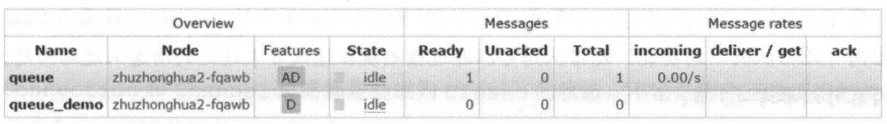

# 消费端的确认与拒绝

## 确认

为了保证消息队列可靠的达到消费者，RabbitMQ 提供了消息确认机制（message acknowledgement）。消费者在订阅队列时，可以指定 autoAck 参数，

- 当为 false 时：RabbitMQ 会 **等待消费者显式回复确认信号** 后才从内存（或磁盘）中移除消息（先打上删除标记，之后再删除）
- 当为 true 时：RabbitMQ 会自动把发送出去的消息设置为确认，然后从删除，而 **不管消费者是否真正消费到了这些消息**

当 autoAck 参数设置为 false 时，对于 RabbitMQ 服务器而言，队列中的消息分成了两个部分：

- 等待投递给消费者的消息

- 已经投递给消费者，但还没有收到消费者确认信号的消息

  如果一直 **没有收到消费者的确认信号**，**并且消费者** 此消息的消费者 **已经断开连接**，则会安排该 **消息重新进入队列**

RabbitMQ 不会为未确认的消息设置过期时间，是否要重新投递给消费者的唯一依据是：**消费者未确认并且已经断开链接**，这允许消费者消费一条消息的时间可以很久很久

web 管理平台（后面会讲解）：



- ready：等待投递给消费者的消息数量
- uncacknowledged ：已经投递给消费者，但是还未收到确认信号的消息数量

也可以通过相应的命令来查看上述消息：

```bash
[root@study ~]# rabbitmqctl list_queues name messages_ready messages_unacknowledged
Listing queues
queue_demo	52	0
# 可以看到这个队列中有 52 条消息
```

## 客户端获取消息队列中的消息数量

对应的 客户端 API 可以这样获取

```java
// 检查该队列是否存在
// 获取一次消费数量，就需要检查一次
final AMQP.Queue.DeclareOk declareOk = channel.queueDeclarePassive(QUEUE_NAME);
// 获取队列中的消息数量
final int messageCount = declareOk.getMessageCount();
final int consumerCount = declareOk.getConsumerCount();
```

## 拒绝消息

在消费者接收到消息后，如果想明确 **拒绝** 而不是 **确认**，可以使用 `Basic.Reject` 命令，对应的 API 是 `channel.basicReject` 方法来拒绝这个消息。

```java
void basicReject(long deliveryTag, boolean requeue) throws IOException;
```

- deliveryTag：可以看作是消息的编号，64 位长整型值。
- requeue：是否重入队列
  - true：会将这条消息重新存储队列，分配给下一个消费者
  - false：会从队列中移除

`Basic.Reject` 只能拒绝一条消息，批量消息可以使用 `Basic.Nack` 命令，对应 API 如下

```java
void basicNack(long deliveryTag, boolean multiple, boolean requeue)
    throws IOException;
```

deliveryTag 和 requeue 的含义与单条的相同。

multiple：

- false：只拒绝 deliveryTag 这一条消息
- true：拒绝 deliveryTag 编号之前所有未被当前消费者确认的消息。

::: tip

将 requeue 设置为 true，可以启用「死信队列」功能。死信队列可以通过 **检测被拒绝或则未送达的消息** 来追踪问题。下个章节会详细讲解

:::

## 重入队列

AMQP 中 `Basic.Recover` 具备可重入队列的特性，对应客户端 API 如下

```java
Basic.RecoverOk basicRecover(boolean requeue) throws IOException;
```

requeue：将此 channel 未确认的消息，重新发送给消费者

- false：将发送给之前相同的消费者
- true：重新加入到队列中