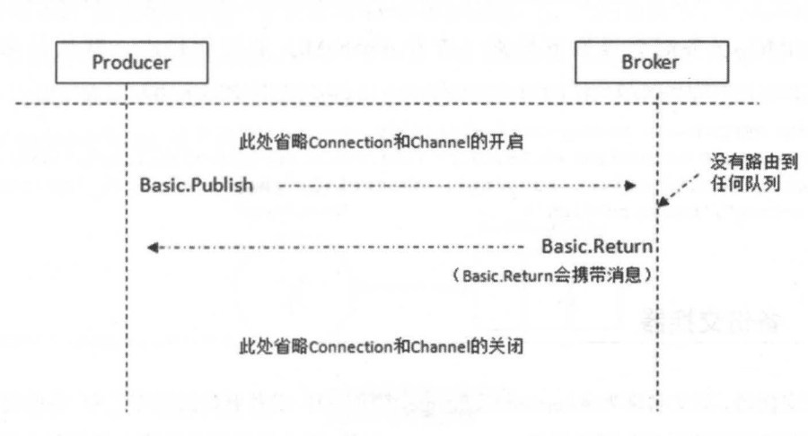
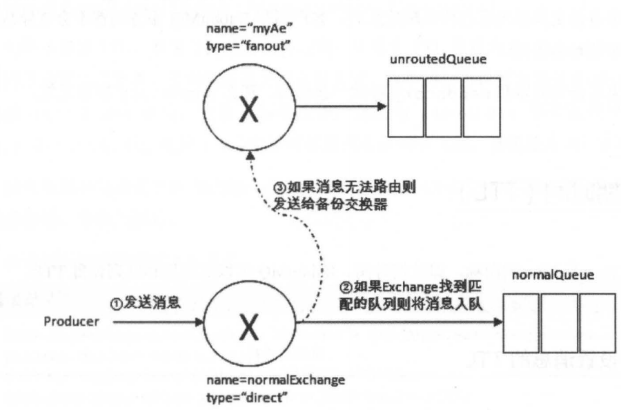

# 消息何去何从

```java
   void basicPublish(String exchange, String routingKey, boolean mandatory, boolean immediate, BasicProperties props, byte[] body)
            throws IOException;
```

mandatory 和 immediate 他们都有当消息传递过程中不可达目的地时将消息 **返回给生产者** 的功能。

RabbitMQ 提供的 **备份交换器（Alternate Exchange）** 可以将 **未能被交换器路由**（没有绑定队列或没有匹配的队列） 的消息存储起来，而不用返回给客户端

那么 mandatory 、immediate 、备份交换器 他们到底是什么？有啥区别？本章就来聊一聊

## mandatory 参数

结论：

- true：找不到匹配的队列，会将消息返回给生产者
- false：找不到匹配的队列，直接丢弃

交换器无法根据自身的类型和路由键找到一个符合条件的队列，将消息返回给生产者（Basic.Return 命令），那么生产者可以通过添加 ReturnListenner 监听器来获取被退回的消息

```java
    @Test
    public void returntest() throws IOException, TimeoutException, InterruptedException {
        final String EXCHANGE_NAME = "exchange_demo";
        final String ROUTING_KEY = "routingky_demo";
        final String QUEUE_NAME = "queue_demo";

        final Channel channel = connection.createChannel();
        // 创建一个 type=direct 持久化、非自动删除的交换器
        channel.exchangeDeclare(EXCHANGE_NAME, "direct", true, false, null);
        // 创建一个：持久化、非排他的、非自动删除的队列
        channel.queueDeclare(QUEUE_NAME, true, false, false, null);
        // 将交换器与队列通过 路由键 绑定
        channel.queueBind(QUEUE_NAME, EXCHANGE_NAME, ROUTING_KEY);

        channel.addReturnListener(new ReturnListener() {
            @Override
            public void handleReturn(int replyCode,
                                     String replyText,
                                     String exchange,
                                     String routingKey,
                                     AMQP.BasicProperties properties,
                                     byte[] body) throws IOException {

                System.out.println("replyCode=" + replyCode +
                        " ; replyText=" + replyText +
                        " ; exchange=" + exchange +
                        " ; routingKey=" + routingKey
                );
                System.out.println("Basic.Return 返回未路由的消息：" + new String(body));
            }
        });
        // 发送的时候，没有指定 ROUTING_KEY
        channel.basicPublish(EXCHANGE_NAME,
                "",
                true,
                MessageProperties.PERSISTENT_TEXT_PLAIN,
                "mandatory test".getBytes()
        );
        TimeUnit.SECONDS.sleep(10);
    }
```

输出的信息为

```
replyCode=312 ; replyText=NO_ROUTE ; exchange=exchange_demo ; routingKey=xx
Basic.Return 返回未路由的消息：mandatory test
```

在 AMQP 协议层面来说，过程如下



## immediate 参数

结论：为 true 时：如果交换器在将消息路由到队列时，发现 **队列上并不存在任何消费者**，那么该 **消息将不会存入队列中**。当与路由键匹配的所有队列都没有消费者时，会通过 Basic.Return 返回给生产者。

mandatory  与  immediate  在功能上区别：

- mandatory  ：要求消息至少被路由到一个队列中，要么丢弃、要么返回给生产者
- immediate：要求至少有一个订阅者，否则就返回给生产者。

**注意：RabbitMQ 3.+ 版本不再对此标记支持**，官方解释：该参数会影响镜像队列的性能，增加代码复杂性。建议采用 TTL 和 DLX 的方法替代（TTL 和 DLX 后续讲解）

## 备份交换器

Alternate Exchange 简称 AE，如果设置 `mandatory = false` ，未被路由的消息会被丢弃，设置为   `mandatory = true` 则需要生产者自己接收未被路由的消息。

如果不想丢失消息，又不想自己立即接收处理这些消息，则可以使用这个备份交换器，**在需要的时候再去处理** 这些消息

可以通过两种方式实现：

1. 可以在声明交换器时，增加 `alternate-exchange` 参数实现
2. 可以通过策略（Policy，后续章节讲解）

如果两种方式同时使用，前者的优先级更高，会覆盖掉 Policy 的设置。

```java
// 定义备份交换器
channel.exchangeDeclare("myAe", "fanout", true, false, null);
channel.queueDeclare("unroutedQueue", true, false, false, null);
channel.queueBind("unroutedQueue", "myAe", "");

final HashMap<String, Object> arguments = new HashMap<>();
arguments.put("alternate-exhcange", "myAe");
// 使用备用交换器 myAe
channel.exchangeDeclare("normalExchange", "direct", true, false, arguments);
channel.queueDeclare("normalQueue", true, false, false, null);
channel.queueBind"normalQueue", "normalExchange", ROUTING_KEY);
```

上面定义了两个交换器和队列，通过  `alternate-exhcange` 参数来指定哪一个是备用交换器；过程如下图所示



其实可以看到备用交换器和普通的交换器没有太大的区别。建议设置为 fanout 类型（广播到订阅到交换器的队列中），因为：消息被重新发送到备用交换器，**路由键还存在**，而 fanout 类型的交换器则会忽略路由键，能确保消息被进入到备用交换器的队列中。

对于备份交换器，总结了以下几种特殊情况：

- 如果设置的备份交换器不存在，客户端和 RabbitMQ 服务端都不会有异常出现，此时消息会丢失。
- 如果备份交换器没有绑定任何队列，不会有异常，此时消息会丢失
- 如果备份交换器没有任何匹配的队列，不会有异常，此时消息会丢失
- 如果备份交换器与 **mandatory 参数一起使用，那么该参数无效**