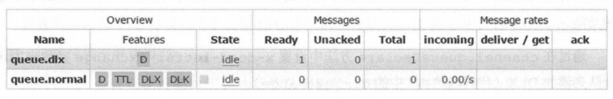
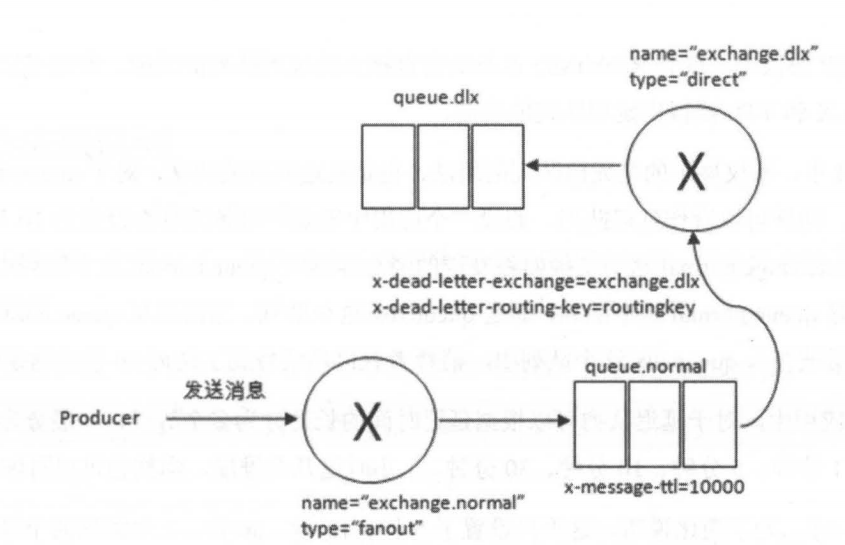

# 死信队列

Dead Letter Exchange 简称 DLX，可称为死信交换器，当消息在一个 **队列中变成死信（dead message）**之后，它能**被重新发送到另一个交换器中**，这个交换器就是 **DLX**，绑定在 DLX 上的队列就称为 **死信队列**。

消息变成死信一般有以下几种情况：

- 消息被拒绝，并设置 requeue 参数未 false

  `Basic.Reject 或 Basic.Nack` 

- 消息过期

- 队列达到最大长度

DLX 是一个普通的交换器，可以在任何队列上设置，当死信消息出现时，RabbitMQ 自动将这个 **消息重新发布到设置的 DLX 上**，从而被路由到另一个队列，即 **死信队列**

在队列定义时，使用 `x-dead-letter-exchange` 参数来为这个队列添加  DLX

```java
final Channel channel = connection.createChannel();
// 定义 dlx
channel.exchangeDeclare("exchange.dlx", "direct", true, false, null);
// 定义 dlx queue
channel.queueDeclare("queue.dlx", true, false, false, null);
channel.queueBind("queue.dlx", "exchange.dlx", "dlx-routing-key");

// 定义正常的交换器
channel.exchangeDeclare("exchange.normal", "fanout", true, false, null);
final HashMap<String, Object> arguments = new HashMap<>();
// 定义队列事，通过该属性给该队列设置 DLX
arguments.put("x-dead-letter-exchange", "exchange.dlx");
// 还可以通过该属性重新消息的路由键，否则使用原消息的路由键
arguments.put("x-dead-letter-routing-key", "dlx-routing-key");
// 设置该队列的 ttl
arguments.put("x-message-ttl", 10000);
channel.queueDeclare("queue.normal", true, false, false, arguments);
channel.queueBind("queue.normal", "exchange.normal", "");
```

代码分为两部分：

1. 定义一个 DLX（其实就是普通的交换器），但是会把他绑定在正常的交换器上；

   为该 DLX 绑定一个队列，用来接收死信消息

2. 定义正常的交换器，并设置 DLX 交换器与路由键

在 web 管理界面中如下图所示：



- D：durable 持久化队列
- TTL：消息有过期时间
- DLX：绑定了死信交换器
- DLK：是这个 `x-dead-letter-routing-key` 死信交换器设置了路由键

一条消息过期时，就如下图所示，被转发到 DLX 交换器中



对于 RabbitMQ 来说， DLX 是非常有用的一个特性。还可以配合  TTL 实现延迟队列的功能。下一节讲解