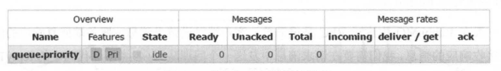

# 优先级队列

优先级高的消息具备 **优先被消费** 的特权。

在定义队列时，可通过参数 `x-max-priority` 来指声明此队列的最大优先级别。在发送消息时，给消息设置的最大级别不能超过这个值

```java
// 定义队列支持的最大级别
final HashMap<String, Object> arguments = new HashMap<>();
arguments.put("x-max-priority", 10);
channel.queueDeclare("queue.priority", true, false, false, arguments);

// 发送消息时设置消息的优先级
final AMQP.BasicProperties.Builder builder = new AMQP.BasicProperties().builder();
builder.deliveryMode(2); // 持久化消息
builder.priority(5);  //设置消息的优先级别
channel.basicPublish(EXCHANGE_NAME,
                     "",
                     builder.build(),
                     "test".getBytes()
                    );
```

在 web 中展示的竖线是 `Pri`



当队列中没有消息堆积的时候，优先级其实就没有什么用了，因为消息来就被消费了