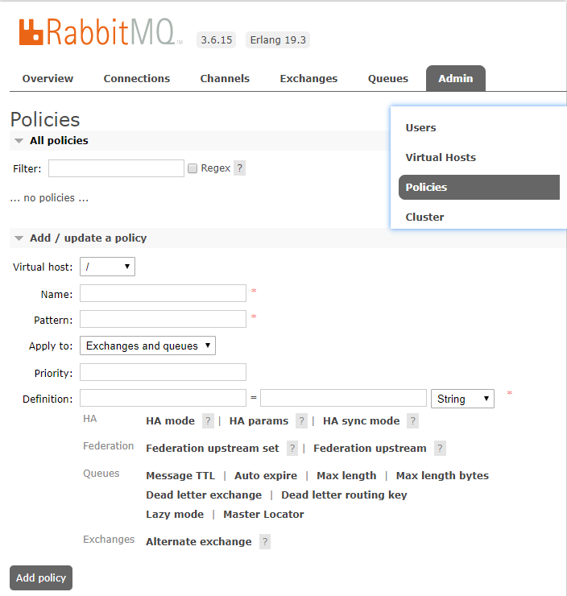

# 参数及策略

RabbitMQ 绝大多数的配置都可以通过  rabbitmq.config 配置文件完成，配置后需要重启 RabbitMQ 服务，对于不需要重启的就可以生效的配置，被称为 **参数（Parameter）**，也可以称为 **运行时参数（Runtime Parameter）**

Parameter 可以通过 rabbitmqctl 或则 RabbitMQ Management 插件提供的 HTTP API 接口来设置。

有两种类型的 Parameter：

- vhost 级别：
- global 级别：

## vhost 级别

操作有三个命令

- set_parameter
- list_parameter
- clear_parameter

###  set_parameter

```bash
rabbitmqctl set_parameter [-p vhost] {component_name} {name} {value}
```

比如下面这个演示

```bash
# 别管这个是什么，因为现在不讲，只看语法。值是  JSON 格式
rabbitmqctl set_parameter federation-upstream f1 '{"uri":"amqp"}'
```

### list_parameter

```bash
rabbitmqctl list_parameter [-p vhost]
```

### clear_parameter

```bash
rabbitmqctl clear_parameter [-p vhost] {component_name} {name} 
```

## global 级别

也有对应的三个命令：set、clear、list

```bash
rabbitmqctl set_global_parameter name value
rabbitmqctl list_global_parameter
rabbitmqctl clear_global_parameter name
```

## Policy

除了一些固定的参数，如：durable、exclusive，客户端在创建交换器或则队列时，可以配置一些可选的属性来获得一些不同的功能，如：`x-message-ttl`、`x-expires` 等。通过客户端设置这些属性，一旦 **设置成功就不能再修改** 了，除非删除原来的交换器或队列之后，重建。 

Policy 就可以解决这类的问题，它是一种 **特殊的 Parameter** 的用法，是 **vhost 级别** 的。一个 Policy 可以匹配一个或则多个队列、交换器，**便于批量管理**

Policy 也可以 **支持动态修改一些属性参数**，一般来说，Policy 用来配置 Federation、镜像、备份交换器、死信等功能。

rabbitmq_managemet 插件提供了对 Policy 的支持。在 `admin/Policies/Add / update a policy` 中可以添加或修改 Policy



- Pattern：一个正则表达式，用来匹配相关的队列或则交换器

- Apply to：用来指定与匹配的目标

  - Exchanges and queues
  - Queues
  - Exchanges

- Priority：优先级

  如果有多个 Policy 匹配到同一个目标，则优先级最大的生效。如果相同，则最后的生效

- Definition：定义一组或则多组键值对，为匹配的交换器或队列附加相应的功能。

### set_policy

Policy 也可以通过 rabbitmqctl 工具或则 HTTP API 接口来操作。语法如下

```bash
rabbitmqctl set_policy [-p vhost] [--prority priority] [--apply-to applyto] {name} {pattern} {definition}
```

### list_policies

```bash
rabbitmqctl list_policies [-p vhost]
```

### clear_polic

```bash
rabbitmqctl clear_polic [-p vhost] {name}
```

